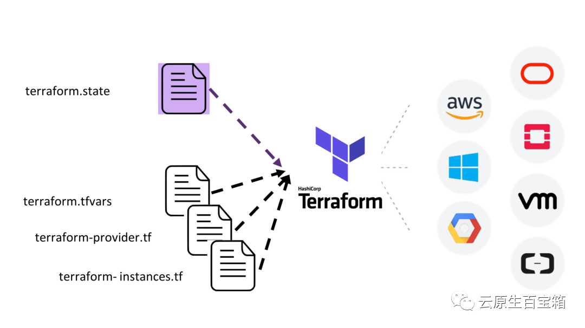
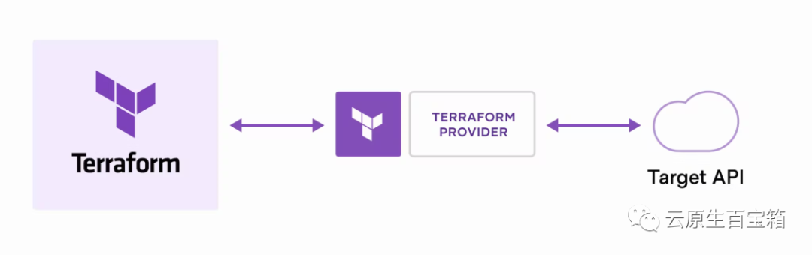
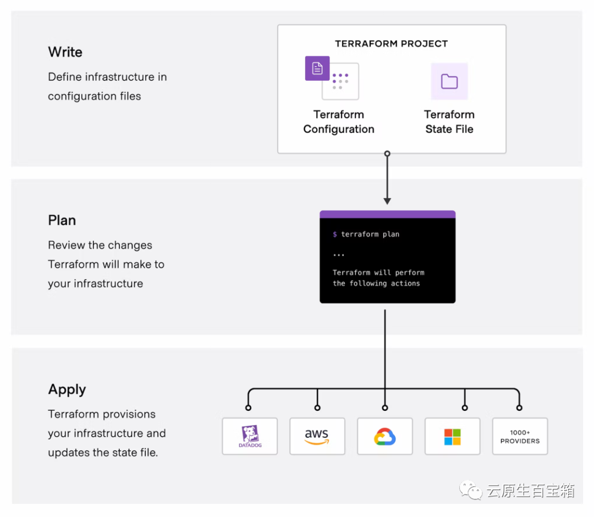
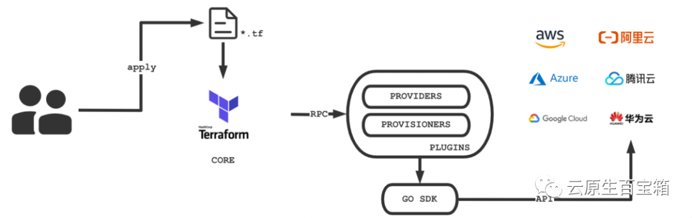
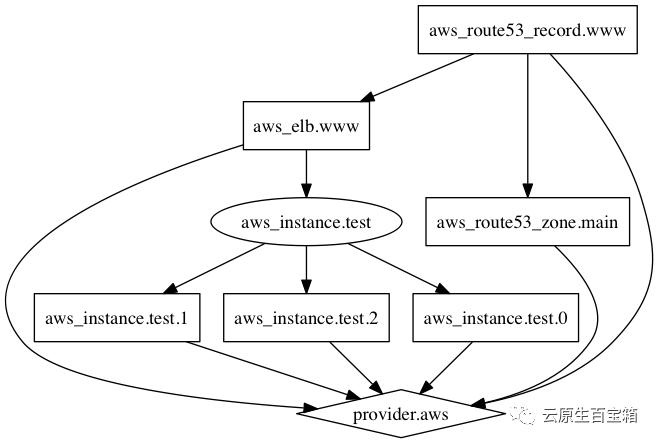

> 学习资料：
https://lonegunmanb.github.io/introduction-terraform/
https://mp.weixin.qq.com/s/CUBHQ2gzIwx_mrNDQAovUg



# 简介
---
Terraform使用一个帮助你`以代码形式管理各种云基础设施服务的工具`。你把你的基础设施代码化，所以它也被称为基础设施即代码（IaC）。

### 云服务优点：
- 减少花销
- 节省时间
- 让客户专注于他们的核心业务
### 为什么要基础设施即代码？
---
随着云服务商数量的增加和他们的他们的服务更加灵活，能够管理你的云基础设施变的越来越重要。
Terraform是基于基础设施即代码（IaC）的概念。简单来说，IaC 是通过代码来管理你的基础设施。
让我们以某个云上的任何计算资源为例，比如AWS的EC2。向AWS申请一个EC2实例，只需要在AWS 注册，提供一堆数值，然后点击 Launch（启动）按键。该资源将会在几分钟内准备好。
只要我们向AWS提供这些值，它们就会在AWS上生成。当然，这样是传统的方式。
Terraform提供了一种方法，以_configurations_的形式获取凭证和输入，在目标云上创建一个资源。
### Terraform好处
---
Terraform 是Hashicorp的一个产品，使用 Hashicorp 配置语法 (HCL)来表示配置。
在下面的例子中，你可以看到EC2实例的最简单的形式的描述：

```json
provider "aws" {
    region = "us-west-1"
}

resource "aws_instance" "myec2" {
    ami = "ami-12345qwert"
    instance_type = "t2.micro"
}
```

这个简单的例子足以让我们了解Terraform的能力。
这个代码包含两个部分`provider`和`resource`。

- `provider` 是Terraform告诉AWS，我们想在`us-west-1`区使用AWS的服务。
- `resource` 让Terraform告诉AWS，在AWS提供的所有基础设施资源中，我们想创建一个实（EC2）。
- `resource`第一个参数为 aws_instance，第二个参数资源的命名，在本例中是myec2。
- `resource`有几个参数，说明AWS机器镜像和用于创建该资源的实例类型。

在这里，我们已经用代码的形式来表示我们的基础设施，让我们看IaC的一些优势。

1. 由于基础设施的创建现在被浓缩在配置/代码文件中，它更容易维护， 因为我们现在可以利用Git等版本控制软件来进行协作和维护。
2. 基础设施的规划阶段所需的时间减少了，因为可以在短时间内编写配置。这些配置很容易被Terraform使用，几分钟就可以创建云资源。
3. 改变基础设施是更容易了, 和改代码一样了。
4. 软件开发中的应用管理生命周期的优势也适用于基础设施。这让它更有效率。

### Terraform 的功能
---


#### 协调工作
当部署各种端到端服务时，涉及到创建云资源时，Terraform作为协调过程的核心。
#### 不与特定云服务商绑定
由于Terraform支持大多数云，包括AWS、MS Azure和GCP，所以你不必担心厂商的锁定问题。Terraform的registry provides提供了所支持的云服务商的文档。

在各种云上的描述基础设施的语法是相同的，因此可以稍后再考虑学习与云服务商相关的特定的API，但不要忘记了。
### 声明式语法
Terraform文件中基础设施是声明性的--所以作为开发者，我们不需要担心让Terraform理解创建资源所需的步骤，相反，我们需要让Terraform知道所需的状态，Terraform会在内部处理这些步骤。

#### 模块化
Terraform 提供的模块可以帮助我们重复使用Terraform的代码。一个复杂的基础设施被分解成多个模块，每个模块都可以在不同的项目中重复使用。

将给定的Terraform配置转换为模块是非常容易的，Terraform有它的预建模块的生态体系。
#### 状态管理
在Terraform创建和规划基础设施的同时，维护状态。这可以与其他团队成员分享，以达到协作的目的。

Terraform让你可以远程管理状态，这有助于防止团队成员在尝试重新创建基础设施时出现混乱。
#### Provisioning
Terraform不是一个完整的配置工具，但它有助于provisioning活动。Terraform的 local-exec 和 remote-exec 模块让你运行内联脚本。内联脚本有助于在成功创建资源后安装软件组件。

这在Chef、Ansible和Salt Stack等配置管理工具安装它们各自的代理时特别有用。当它们安装成功，就直接发送一个UP信号。

#### 开源
Terraform 是开源软件。当然它也有一个企业版。

### Terraform 的工作流程
---

你需要采取一些简单的步骤来运行你的Terraform代码。这些步骤与云平台上的资源的生命周期密切相关。
同样，这些步骤跟云平台无关，这意味着同样的步骤/命令可以在任何给定的云平台上创建,更新，和销毁资源都是有效的。
注意:，本文不涉及 Terraform的安装步骤，我假设你已经在系统中安装了Terraform CLI。
#### 运行init命令
当我们准备好了配置文件，我们需要运行的第一个命令是 terraform init。Terraform的安装二进制并不包含对所有云服务商的支持。

相反，根据云供应商，在Terraform运行代码前，会下载适当的插件。在我们的例子中，运行terraform init将下载AWS提供插件。这个命令帮助 initialize 这个给定的 Terraform目录。
#### 生成一个执行计划Plan
terraform plan，命令 生成一个执行计划。根据你提供的配置，Terraform会生成一个执行计划。在这个阶段，Terraform会在语法错误、API认证、状态验证等方面进行可行性检查。

plan 在实际执行前高亮显示Terraform 脚本中的任何修改。如果它成功了，它会输出基础设施中潜在变化的摘要。你应该在 apply 命令之前运行它。因为它能让你在修改基础设施之前意识到风险。
terraform plan [-out=devops_overview.plan]

#### Apply 让改变生效

terraform apply命令将执行对基础设施的任何改变。你应该在运行terraform apply之前运行plan命令，会创建一个plan文件，在apply阶段提供参考消息。
terraform apply [devops_overview.plan] [--auto-approve]
#### 销毁destroy资源
最后，`terraform destroy`命令销毁属于当前配置/状态的任何资源。

### 实战
---
#### 安装Terraform
https://developer.hashicorp.com/terraform/downloads?product_intent=terraform

```bash
wget -O- https://apt.releases.hashicorp.com/gpg | sudo gpg --dearmor -o /usr/share/keyrings/hashicorp-archive-keyring.gpg
echo "deb [signed-by=/usr/share/keyrings/hashicorp-archive-keyring.gpg] https://apt.releases.hashicorp.com $(lsb_release -cs) main" | sudo tee /etc/apt/sources.list.d/hashicorp.list
sudo apt update && sudo apt install terraform
```
#### 创建&销毁EC2
---
让我们试着通过在AWS上实际创建一个EC2实例，来实践我们目前学到的东西。
首先，如果你还没安装Terraform CLI。其实安装非常简单，你可以找到你的操作系统的安装步骤。

在你的系统中创建一个目录/文件夹，并创建第一个Terraform文件类型，讲其命名为main.tf。默认情况下，只要它的扩展名为.tf，我们可以给它起任何名字。
```bash
mkdir terraform
cd terraform
vim main.tf
```

Terraform CLI会识别存在特定的目录下的所有扩展名为`.tf`的文件，然后执行。

将上述代码粘贴在该文件中并保存。**请注意**，你需要根据你的区域（region）使用正确的AMI。
```json
provider "aws" {
    region = "us-west-1"
}

resource "aws_instance" "myec2" {
    ami = "ami-12345qwert"
    instance_type = "t2.micro"
}
```
由于这是第一次执行Terraform代码，我们需要在这个目录中初始化 Terraform，运行terraform init，将安装AWS所需的插件。

启动一个终端，进入到我们的Terraform所在的目录，并运行以下命令。
```bash
terraform init
```

这应该产生如下输出，非常清楚，我们可以看到安装的AWS插件的安装版本是V3.22.0

```bash
Initializing the backend...
Initializing provider plugins...
- Reusing previous version of hashicorp/aws from the dependency lock file
- Installing hashicorp/aws v3.22.0...
- Installed hashicorp/aws v3.22.0 (signed by HashiCorp)
Terraform has been successfully initialized!
You may now begin working with Terraform. Try running "terraform plan" to see
any changes that are required for your infrastructure. All Terraform commands
should now work.
If you ever set or change modules or backend configuration for Terraform,
rerun this command to reinitialize your working directory. If you forget, other
commands will detect it and remind you to do so if necessary.
```

配置SecretId
个人用户->访问管理->访问密钥—>API密钥管理
```bash
nano /etc/profile
export TF_VAR_secret_id=
export TF_VAR_secret_key=
``````


接下来，我们将运行`terraform plan`命令参看一个暂定的执行计划。这也会对任何语法或引用错误进行验证。`plan`命令检查`main.tf`文件中所声明的资源的可行性。在同一个终端上运行这个命令。
```bash
terraform plan
```
如果一切工作顺利，会产生以下输出。

```bash
An execution plan has been generated and is shown below.
Resource actions are indicated with the following symbols:
  + create

Terraform will perform the following actions:

  # aws_instance.example will be created
  + resource "aws_instance" "myec2" {
      + ami                          = "ami-12345qwert"
      + arn                          = (known after apply)
      + associate_public_ip_address  = (known after apply)
. . .
Plan: 1 to add, 0 to change, 0 to destroy.

------------------------------------------------------------------------

Note: You didn't specify an "-out" parameter to save this plan, so Terraform
can't guarantee that exactly these actions will be performed if
"terraform apply" is subsequently run.
```
此外，它还表明其他的属性，如arn和associate_public_ip_addres是已知的，即创建实例的时间。
上面的虚线上的表示最终的一组变化--增加add一种资源，没有任何变化change或者销毁destroy。
所以，到现在为止，一切看起来很好。让我们继续并配置应用。在终端运行下面的命令并观察输出。
```bash
terraform apply [--auto-approve]
```
一旦确认，需要几秒时间来完成AWS上的EC2实例的创建，这可以从`terraform apply`产生的输出看到。
正如下面的输出所示，在我的情况下，创建EC2实例需要51秒，而且实例的ID也是可用的。
通过登录你的AWS控制台并搜索具有以下的ID的EC2实例，来验证这一点。如果这一切运作良好，你应该能找到它。
```bash
Plan: 1 to add, 0 to change, 0 to destroy.

Do you want to perform these actions?
  Terraform will perform the actions described above.
  Only 'yes' will be accepted to approve.

  Enter a value: yes

aws_instance.myec2: Creating...
aws_instance.myec2: Still creating... [10s elapsed]
aws_instance.myec2: Still creating... [20s elapsed]
aws_instance.myec2: Still creating... [30s elapsed]
aws_instance.myec2: Still creating... [40s elapsed]
aws_instance.myec2: Still creating... [50s elapsed]
aws_instance.myec2: Creation complete after 51s [id=i-04ef3120a0006a153]


Apply complete! Resources: 1 added, 0 changed, 0 destroyed.
```

因此，我们已经成功地使用IaC来定义/声明和创建我们在AWS上的虚拟机的配置。
如果我不需要这个虚拟机了，我们可以用相同的配置来销毁它。
**请注意**，如果我们对配置做了任何修改，但不打算应用这些修改，然后我们试图销毁以前的配置，我们可能会遇到错误。
这是因为Terraform在状态文件中维护了配置和现实世界资源之间的关系。改变配置会影响它的应用关系。Terraform将把这视为要创建新的资源。

Terraform 状态是一个值得单独讨论的话题，所以我们将在后面介绍。现在，要销毁EC2实例，在终端运行以下命令。
```bash
terraform destroy [--auto-approve]
```
在销毁资源之前，Terraform通过输出一个计划，要求我们进行确认。它表明，运行destroy命令将销毁1个资源，这是我们所期望的。
```bash
Terraform destroy
Plan: 0 to add, 0 to change, 1 to destroy.

Do you really want to destroy all resources?
  Terraform will destroy all your managed infrastructure, as shown above.
  There is no undo. Only 'yes' will be accepted to confirm.

  Enter a value: yes

aws_instance.myec2: Destroying... [id=i-04ef3120a0006a153]
aws_instance.myec2: Still destroying... [id=i-04ef3120a0006a153, 10s elapsed]
aws_instance.myec2: Still destroying... [id=i-04ef3120a0006a153, 20s elapsed]
aws_instance.myec2: Still destroying... [id=i-04ef3120a0006a153, 30s elapsed]
aws_instance.myec2: Still destroying... [id=i-04ef3120a0006a153, 40s elapsed]
aws_instance.myec2: Still destroying... [id=i-04ef3120a0006a153, 50s elapsed]
aws_instance.myec2: Still destroying... [id=i-04ef3120a0006a153, 1m0s elapsed]
aws_instance.myec2: Destruction complete after 1m5s

Destroy complete! Resources: 1 destroyed.
```
同样，销毁资源也需要几秒钟，Terraform不会让你一直悬着，因为它会每10秒更新状态。
一旦资源被销毁，它就会确认它已经完成。
验证：请登录AWS控制台，验证资源是否被终止。

### Terraform 启用插件缓存
---
在刚刚进行 init 初始化时，Terraform 会根据 tf 文件内的 Provider 下载对应的插件，这些插件往往体积比较大。
例如上面初始化时下载的 AWS Provider 体积就有>200M，如果不启用插件缓存，那么在每个 Terraform 项目中都会反复下载这些插件，就很浪费磁盘空间与流量，因此建议将插件缓存开启。

Windows 下是在相关用户的 %APPDATA% 目录下创建名为 "terraform.rc" 的文件，Macos 和 Linux 用户则是在用户的 家下创建名为 "$HOME/.terraformrc" 的文件

.terraformrc 文件内容为：
```json
plugin_cache_dir = "$HOME/.terraform.d/plugin_cache"
```
这样每次下载 Provider 插件时，就会下载到 "$HOME/.terraform.d/plugin-cache" 目录下了。
不过 Terraform 不会主动清理这个文件夹，因此可能随着插件版本的更迭，这个文件夹内会保存一些历史版本的 Provider 插件，这时就需要自己手动清理一下了。
### Terraform 可视化
---
terraform graph命令可以用来生成代码描述的基础设施或是执行计划的可视化图形。它的输出是DOT格式，可以使用GraphViz来生成图片，也有许多网络服务可以读取这种格式。
#### 用法
---
```bash
terraform graph [options] [DIR]
```
该命令生成DIR路径下的代码锁描述的Terraform资源的可视化依赖图(如果DIR参数缺省则使用当前工作目录)

-type参数被用来指定输出的图表的类型。Terraform为不同的操作创建不同的图。对于代码文件，默认类型为"plan"，对于变更计划文件，默认类型为"apply"。
参数说明：
-  -draw-cycles：用彩色的边高亮图中的环，这可以帮助我们分析代码中的环错误(Terraform禁止环状依赖)
-  -type=plan：生成图表的类型。可以是：plan、plan-destroy、apply、validate、input、refresh
#### 创建图片文件

terraform graph命令输出的是DOT格式的数据，可以轻松地使用GraphViz转换为图形文件：
```bash
terraform graph | dot -Tsvg > graph.svg
```
输出的图片大概是这样的：

#### 安装GraphViz
安装GraphViz也很简单，对于Ubuntu：
```bash
sudo apt install graphviz
```
对于CentOS：
```bash
sudo yum install graphviz
```
对于Windows，也可以使用choco：
```bash
choco install graphviz
```
对于Mac用户：
```bash
brew install graphviz
```
### Terraform 命令
---
terraform 子命令
#### 常用基础命令
---

子命令    |说明
---|---
init    |初始化一个包含terraform 代码的工作目录
plan    |查看&创建变更计划
apply    |生成&执行变更计划
show    |展示-read当前所有归terraform控制的资源的状态信息
destroy    |销毁&收回所有terraform管理的基础设施资源

#### 扩展命令
---
子命令|说明
---|---
fmt|格式化terraform代码文件的格式和规范
show|展示-read当前所有归terraform控制的资源的状态信息
apply -auto-approve |以非交互的方式同意并执行计划
destroy -auto-approve |以非交互的方式同意并销毁
import |将已有云资源导入到terraform的state管理中
validate |验证模板语法是否正确
state list |列出当前state中的所有资源
state show 资源名称 |显示某一个资源的属性
taint |标记资源为被污染
untaint |取消被污染标记
refresh |刷新当前state的内容，即再次调用API并拉取最新的数据，写入到state文件中
graph |生成执行计划的关系图
graph \| dot -Tsvg >graph.svg | 将关系图导出为svg类型。 （先安装好graphviz）

### 参考资料
https://developer.hashicorp.com/terraform/intro
https://lonegunmanb.github.io/introduction-terraform/
https://developer.hashicorp.com/terraform/tutorials/aws-get-started
